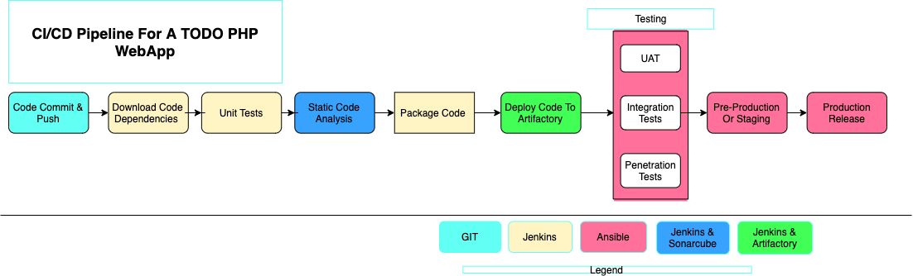

# CI/CD pipeline for a PHP-based application using Jenkins, Ansible, Nexus Repository, and Sonarqube

In this project, I will walk you through the entire concept of CI/CD from an application perspective and present a hands-on guide to enable you to set up a CI/CD pipeline to deploy an application. This project has some initial theoretical concepts that must be well understood before moving on to the practical part. To successfully implement this project, it is crucial to grasp the importance of the entire CI/CD process, the roles of each tool, and success metrics. Refer to my previous article, "(Continuous Integration and Continuous Development (CI/CD) and its Importance in DevOps)[https://medium.com/@angalabiridortimiariyemaxwell/continuous-integration-and-continuous-development-ci-cd-and-its-importance-in-devops-d7b7b6492177]" to read up on the theoretical concepts needed to successfully understand the implementation of this project.
In this project, I will be simulating an end-to-end continuous integration and delivery pipeline to deploy a TODO web application. This application is built using PHP, which is an interpreted scripting language. This means it can be deployed directly onto a server and will work without compiling the code to a machine language (which is the case for compiled languages like Java,.NET, etc.).
The problem with that approach is that it would be difficult to package and version the software for different releases. And so, in this project, I will be using a different approach for releases. Rather than downloading the source code directly from Git, I will be using the Ansible uri module.

**Project Architecture**

The architectural diagram of the project is shown below:



Simulating all the various environments, from dev/ci to production, for this project will require a considerable number of servers. However, it is advisable to only create the servers necessary for the environment currently being worked on. For instance, when deploying for development, do not create servers for integration, pentest, or production yet.
To get started, we will initially focus on these environments.
Ci
Dev
Pentest

The SIT (System Integration Testing) and UAT (User Acceptance Testing) environments are essentially the webservers holding the application so they don't need additional installation or configuration. However, Pentest (Penetration Testing) requires specific configurations and additional tools as it is primarily used for security-related tests. In some cases, it may also be used for performance and load testing. Alternatively, it may be a separate environment on its own, depending on the team and company decisions.

In this project, Nginx will be used to serve as a reverse proxy for our sites and tools. Each environment setup is represented in the below table and diagrams.


ci


Others


__DNS requirements__

Make DNS entries to create a subdomain for each environment. Assuming your main domain is todoapp.com. This can be done on Godaddy, AWS Route53, or any other domain management provider.
You should have a subdomain list like this:


**STEP 1: Set up Inventory files**

1. Create an inventory file for all environments

```SHELL
cd inventory
touch dev && touch uat && touch pentest && touch ci && touch preprod && touch prod && touch sit
```

2. Create the below instances and update the inventory files for ci and dev with the ip addresses:

- ci

nginx (RHEL 8, t2-micro), 
sonarqube (ubuntu, t2-medium),
artifactory (RHEL 8, t2-micro)


- dev

nginx, 
todo webserver (RHEL 8, t2-micro),
tooling webserver (RHEL 8, t2-micro)
db (ubuntu, t2-micro)

4. update the dev and ci inventory files with the private ip of the above servers

ci

```SHELL
jenkins-server ansible_host=<Private-IP-Address>
nginx-server ansible_host=<Private-IP-Address>
sonarqube-server ansible_host=<Private-IP-Address>
artifactory-server ansible_host=<Private-IP-Address>

[jenkins]
jenkins-server ansible_user=ec2-user

[nginx]
nginx-server ansible_user=ec2-user

[sonarqube]
sonarqube-server ansible_user=ubuntu

[artifactory]
artifactory-server ansible_user=ec2-user
```

dev

```SHELL
nginx-server ansible_host=<Private-IP-Address>
db-server ansible_host=<Private-IP-Address>
todo-server ansible_host=<Private-IP-Address>
tooling-server ansible_host=<Private-IP-Address>


[nginx]
nginx-server ansible_user=ec2-user

[db]
db-server ansible_user=ubuntu

[todo]
todo-server ansible_user=ec2-user

[tooling]
tooling-server ansible_user=ec2-user
```

__STEP 2: Setup Jenkins Configurations__

1. launch a t2-medium RHEL server to run jenkins and ansible, ssh into this instance and initialize a new git repo called "ansible-config"
2. In the ansible-config directory create an inventory directory with inventory file for the different environments
3. Install jenkins on the control server. The steps to install jenkins are detailed in [Install Jenkins](https://www.jenkins.io/doc/book/installing/linux/):

```SHELL
sudo yum install wget -y
sudo wget -O /etc/yum.repos.d/jenkins.repo \
    https://pkg.jenkins.io/redhat-stable/jenkins.repo

sudo rpm --import https://pkg.jenkins.io/redhat-stable/jenkins.io-2023.key
sudo yum upgrade -y
# Add required dependencies for the jenkins package
sudo yum install java-11-openjdk -y 
sudo yum install jenkins -y
sudo systemctl start jenkins
sudo systemctl enable jenkins
sudo systemctl daemon-reload
```

4. It is recommended you assign an elastic ip to the jenkins server. Ensure port 8080 is open on the jenkins server, Setup jenkins by accessing the jenkins ui using <public_ip:8080>, get your set password by running "sudo cat /var/lib/jenkins/secrets/initialAdminPassword", install recommended pluggins, create and account and start using jenkins.

5. Install & Open Blue Ocean Jenkins Plugin. Go to "Manage Jenkins"> Manage pluggin> click on "Available Pluggins > Search for "Blue Ocean" and install without restart.
6. Create a new pipeline by going back to the Jenkins Dashboard, click on the "Blue Ocean" icon and click on "Create a new pipeline". 


7. Select GitHub
8. On the "Connect to Github section, click on "Create an access token" to login to GitHub & Generate an Access token.
9. Enter your github access token
10. Click on your github account and select the "ansible-config" repository to complete the setup.

At this point you may not have a Jenkinsfile in the Ansible repository, so Blue Ocean will attempt to give you some guidance to create one. But we do not need that. We will rather create one ourselves. So, click on "Administration" to exit the Blue Ocean console.


At the stage, we have created a new pipeline. It takes the name of your GitHub repository.


11. The goal is to run the ansible playbooks using jenkins. To do this we need to create a "Jenkinsfile". Inside the Ansible-config directory, create a new directory called "deploy" and create a new file call "Jenkinsfile" inside this directory.

12. Add the code snippet below to start building the Jenkinsfile gradually. This pipeline currently has just one stage called Build and the only thing we are doing is using the shell script module to echo Building Stage

```SHELL
pipeline {
    agent any

  stages {
    stage('Build') {
      steps {
        script {
          sh 'echo "Building Stage"'
        }
      }
    }
    }
}
```
13. Commit and push these changes to github
14. Now go back into the Ansible pipeline ("ansible-config") in Jenkins, and select "configure"
15. Scroll down to "Build Configuration" section and specify the location of the Jenkinsfile at deploy/Jenkinsfile, the save this change. This will automatically scan the github repo to identify the branches and files in the repo.


16. Then go back to jenkins and in the pipeline again, click "Build now" to run the pipeline. This would fetch the code from github and run the simple pipeline we added to the jenkins file.

This will trigger a build and you will be able to see the effect of our basic Jenkinsfile configuration by going through the console output of the build.


To really appreciate and feel the difference of Blue Ocean UI, we will be triggering the build again from Blue Ocean interface.

* Click on Blue Ocean, select the "ansible-config" job, click on the branch (this will be "main" at this point) and click on the play icon.


Notice that this pipeline is a multibranch one. This means, if there were more than one branch in GitHub, Jenkins would have scanned the repository to discover them all and we would have been able to trigger a build for each branch.

To demonstrate this:

* Create a new git branch and name it feature/jenkinspipeline-stages
* Currently we only have the Build stage. Let us add another stage called Test. Paste the code snippet below and push the new changes to GitHub.

```SHELL
pipeline {
  agent any
  
  stages {
    stage('Build') {
      steps {
        script {
          sh 'echo "Building Stage"'
        }
      }
    }

    stage('Test') {
      steps {
        script {
          sh 'echo "Testing Stage"'
        }
      }
    }
    }
}
```
* Commit and push these changes to github.
* To make your new branch show up in Jenkins, we need to tell Jenkins to scan the repository by clicking on the "Administration" button and the the "Scan Repository Now" icon.


* Refresh the page and both branches will start building automatically. You can go into Blue Ocean and see both branches there too.


* In Blue Ocean, you can now see how the Jenkinsfile has caused a new step in the pipeline launch build for the new branch.


Next we will carry out the below steps:

1. Create a pull request to merge the latest code into the main branch
2. After merging the Pull Request, go back into your terminal and switch into the main branch.
3. Pull the latest change.
4. Create a new branch, add more stages into the Jenkinsfile to simulate below phases. 
    1. Add a stage to clean up workspace at the beginning of the pipeline.
   2. Echo "Package"
   3. Echo "Deploy"
   4. Clean up

```SHELL
pipeline {
  agent any
  
  stages {
    stage("Initial Cleanup") {
      steps {
        dir("${WORKSPACE}") {
          deleteDir()
        }
      }
    }

    stage('Build') {
      steps {
        script {
          sh 'echo "Building Stage"'
        }
      }
    }

    stage('Test') {
      steps {
        script {
          sh 'echo "Testing Stage"'
        }
      }
    }
    stage('Package') {
      steps {
        script {
          sh 'echo "Packaging Stage"'
        }
      }
    }
    stage('Deploy') {
      steps {
        script {
          sh 'echo "Deploying Stage"'
        }
      }
    }
    stage('Clean Up') {
      steps {
        cleanWs(cleanWhenAborted: true, cleanWhenFailure: true, cleanWhenNotBuilt: true, cleanWhenUnstable: true, deleteDirs: true)
      }
    }
  }
}
```

5. Verify in Blue Ocean that all the stages are working, then merge your feature branch to the main branch


6. Eventually, your main branch should have a successful pipeline like this in blue ocean


**STEP 3: Install Ansible and Setup Ansible Role for CI Environment**

Three roles are required for the ci environment so we will be adding the below roles. To do this:

* Install ansible on the jenkins server.

```Shell
sudo yum install ansible -y
```

* Install ansible dependencies to enable us run mysql and postgresql using ansible.

```SHELL
sudo yum install python3 python3-pip wget unzip git -y

# Upgrade pip package
sudo python3 -m pip install --upgrade setuptools
sudo python3 -m pip install --upgrade pip

# Dependencies to run sql commands
sudo python3 -m pip install PyMySQL
sudo python3 -m pip install mysql-connector-python
sudo python3 -m pip install psycopg2==2.7.5 --ignore-installed

# For mysql db
ansible-galaxy collection install community.mysql
```

* Create a new directory called "roles" inside the "ansible-config" directory.
* Initialize the below three roles using ansible-galaxy

    * Sonarqube, Artifactory, nginx and mysql

```SHELL
cd roles
ansible-galaxy init sonarqube
ansible-galaxy init artifactory
ansible-galaxy install geerlingguy.nginx -p . && mv geerlingguy.nginx/ nginxRole
ansible-galaxy install geerlingguy.mysql -p . && mv geerlingguy.mysql/ ./mysql
```

**Why do we need SonarQube?**

SonarQube is an open-source platform developed by SonarSource for continuous inspection of code quality, it is used to perform automatic reviews with static analysis of code to detect bugs, code smells, and security vulnerabilities. [Watch a short description here](https://youtu.be/vE39Fg8pvZg). There is a lot more hands on work ahead with SonarQube and Jenkins. So, the purpose of SonarQube will be clearer to you very soon.

Why do we need Artifactory?
Artifactory is a product by JFrog that serves as a binary repository manager. The binary repository is a natural extension to the source code repository, in that the outcome of your build process is stored. It can be used for certain other automation, but we will it strictly to manage our build artifacts.

[Watch a short description here](https://youtu.be/upJS4R6SbgM) Focus more on the first 10.08 mins

**STEP 4: Running Ansible Playbook from Jenkins**

Now that you have a broad overview of a typical Jenkins pipeline. Let us get the actual Ansible deployment to work by:

1. Installing Ansible plugin in Jenkins UI: Navigate to Dashboard>Manage Jenkins>Plugin Manager>Available plugins and search for "Ansible". Install without restart.


Go back to "Dashboard>Manage Jenkins>Global Tools Configuration" and enter the below configuration under "Ansible"


2. Creating Jenkinsfile from scratch. (Delete all you currently have in there and start all over to get Ansible to run successfully). This should take care of the following considerations:

* This jenkinsfile should be parameterized to run against different environments without editting the file directly.
* It should include a stage to checkout the SCM to a specified branch.
* Jenkins should export the ANSIBLE_CONFIG environment variable. ansible.cfg file should be added to the "deploy" folder alongside the Jenkinsfile. This way, anyone can easily tell that everything in there are related to deployment.
* Dynamically set the environment variables (very importantly, the Role variable) each time the job runs.
* This pipeline should always delete the already existing files generated from previous runs. This is done by adding a clean up step at the begining of the script.
* Using the "Pipeline Syntax tool in jenkins, generate the syntax to create environment variables to set dynamically each time the pipeline is ran and run the ansible-playbook.
* A final step to clean up the workspace after build.

To run the ansible playbooks against the servers, jenkins would need to ssh into the server and it requires the private keys of the servers to do this. I used just one key for all servers so I need to add this key to jenkins credentials. To do this, navigate to "Manage Jenkins>Credentials>Global Credentials>Add Credentials" and configure it as shown below. In the "Key" section, copy your private key and add it to the box below. Jenkins would use this credentials to connect to the servers while running the ansible playbook.


**Ansible.cfg file**

```SHELL
[defaults]
timeout = 160
callback_whitelist = profile_tasks
log_path=~/ansible.log
host_key_checking = False
gathering = smart
ansible_python_interpreter=/usr/bin/python3
allow_world_readable_tmpfiles=true


[ssh_connection]
ssh_args = -o ControlMaster=auto -o ControlPersist=30m -o ControlPath=/tmp/ansible-ssh-%h-%p-%r -o ServerAliveInterval=60 -o ServerAliveCountMax=60 -o ForwardAgent=yes
```

**Jenkinsfile**

```SHELL
pipeline {
  agent any

  environment {
      ANSIBLE_CONFIG="${WORKSPACE}/deploy/ansible.cfg"
    }

  parameters {
      string(name: 'inventory', defaultValue: 'dev',  description: 'This is the inventory file for the environment to deploy configuration')
      string(name: 'gitBranch', defaultValue: 'feature/jenkinspipeline-stages', description: 'SCM Git branch to checkout')
    }

  stages{
      stage("Initial cleanup") {
          steps {
            dir("${WORKSPACE}") {
              deleteDir()
            }
          }
        }

      stage('Checkout SCM') {
         steps{
            git branch: "${gitBranch}", url: 'https://github.com/doutimi3/ansible-config.git'
         }
       }

      stage('Prepare Ansible For Execution') {
        steps {
          sh 'echo ${WORKSPACE}' 
          sh 'sed -i "3 a roles_path=${WORKSPACE}/roles" ${WORKSPACE}/deploy/ansible.cfg'  
        }
     }

      stage('Run Ansible playbook') {
        steps {
           ansiblePlaybook become: true, colorized: true, credentialsId: 'private-key', disableHostKeyChecking: true, installation: 'ansible', inventory: 'inventory/${inventory}', playbook: 'playbooks/site.yml'
         }
      }

      stage('Clean Workspace after build'){
        steps{
          cleanWs(cleanWhenAborted: true, cleanWhenFailure: true, cleanWhenNotBuilt: true, cleanWhenUnstable: true, deleteDirs: true)
        }
      }
   }

}
```

In the mysql role, navigate to "defaults>main.yml" and add the below block of code under the "Databases" section.

```YAML
# Databases.
mysql_databases:
  - name: tooling
    collation: utf8_general_ci
    encoding: utf8
    replicate: 1
```

Also add the below block of code under the "Users" section
```SHELL
# Users.
mysql_users:
  - name: webaccess
    host: 0.0.0.0
    password: secret
    priv: '*.*:ALL,GRANT'
```

In the nginxRole role, navigate to "defaults>main.yml" and clear all contents of this file.

Still in the nginxRole, navigate to "tasks>main.yml", clear all contents and add the below block of code:

```YAML
---
# tasks file for nginx
- name: install nginx on the webserver
  ansible.builtin.yum:
      name: nginx
      state: present


- name: ensure nginx is started and enabled
  ansible.builtin.service:
     name: nginx
     state: started 
     enabled: yes

- name: install PHP
  ansible.builtin.yum:
    name:
      - php 
      - php-mysqlnd
      - php-gd 
      - php-curl
    state: present
```
Still in the nginxRole, navigate to "tasks>main.yml", delete all other yml files aside from the "main.yml" file. 

Still in the nginxRole, navigate to "templates" directory, delete all configuration files and create a new file call "nginx.conf" with the below content. 

```SHELL
upstream backend {
      server  <private ip> weight=5; 
      server  <private ip> weight=5;
      
   }

   # This server accepts all traffic to port 80 and passes it to the upstream. 
   # Notice that the upstream name and the proxy_pass need to match.

   server {
      listen 80; 

      location / {
          proxy_pass http://backend;
      }
   }
```
* Create another folder called "static-assignments".
* Create a new file called nginx.yml inside the above folder and add the below lines of code:

```YAML
---
- hosts: nginx
  become: true
  roles:
     - nginxRole
```

* Add another file called "database.yml" inside the above folder with the below lines of code:
```YAML
---
- hosts: db
  roles:
    - mysql
```

* Create a new folder called "playbooks", inside this folder, create a file called "site.yml" and add the below block of code

```YAML
---
- hosts: db
- name: database assignment
  ansible.builtin.import_playbook: ../static-assignments/database.yml

- hosts: nginx
- name: nginx assignment
  ansible.builtin.import_playbook: ../static-assignments/nginx.yml
```

* Commit changes to the feature/pipeline-stages branch, confirm that this worked as expected on jenkins and create a pull request to merge it to main branch.

* On the Jenkins UI, navigate to "Dashboard>ansible-config" and click on "Scan repository Now". This will scan the repo to include the recent changes and trigger the build. The build might fail because we have not set the parameters for "inventory" and "gitBranch"

* Click on the "feature/jenkinspipeline-stages" branch and click on "Build with Parameters" to set the inventory and gitBranch parameters and click on "Build" to trigger the build.


This would run run all stages specified in the Jenkinsfile. See below the output of the stage that triggers the ansible-playbook to configure the nginx and database servers.


Notice that we can now specify which environment we want to deploy the configuration to. Simply configure your "sit" inventory file, go to "Build with Parameters" and type "sit" and "Build" to run the pipeline against the sit environment.

As I mentioned earlier "The SIT (System Integration Testing) and UAT (User Acceptance Testing) environments are essentially the webservers holding the application so they don't need additional installation or configuration." So to avoid spinning up new servers for this I will be copying the contents of the dev inventory file into the sit inventory file.

```SHELL
[tooling]
<SIT-Tooling-Web-Server-Private-IP-Address>

[todo]
<SIT-Todo-Web-Server-Private-IP-Address>

[nginx]
<SIT-Nginx-Private-IP-Address>

[db]
<SIT-DB-Server-Private-IP-Address>

[db:vars]
ansible_user=ec2-user
```

To run this against the sit environment, we first need to setup the webserver ansible configurations. To do this:

* Under the "roles" directory, create a new role called "webserver"
```SHELL
ansible-galaxy init webserver
```
* Navigate to "Roles > webserver > tasks > main.yml" and add the below block of codes:

```YAML
---
# tasks file for webserver
- name: install apache
  become: true
  yum:
    name: "httpd"
    state: present

- name: install git
  become: true
  yum:
    name: "git"
    state: present

- name: clone a repo
  become: true
  git:
    repo: https://github.com/doutimi3/devops_tooling.git
    dest: /var/www/html
    force: yes

- name: copy html content to one level up
  become: true
  command: cp -r /var/www/html/html/ /var/www/

- name: Start service httpd, if not started
  become: true
  ansible.builtin.service:
    name: httpd
    state: started

- name: recursively remove /var/www/html/html/ directory
  become: true
  ansible.builtin.file:
    path: /var/www/html/html
    state: absent
```
* Navigate to "Roles > webserver > templates" directory, create a new file file called "apache-conf.j2" and add the below block of codes:

```SHELL
<VirtualHost *:80>
    ServerAdmin webmaster@{{ domain }}
    ServerName {{ domain }}
    ServerAlias www.{{ domain }}
    DocumentRoot /var/www/html
    ErrorLog ${APACHE_LOG_DIR}/error.log
    CustomLog ${APACHE_LOG_DIR}/access.log combined
</VirtualHost>
```
* Navigate to "static-assignment" directory and create a new file called "webserver.yml" with the below content:

```YAML
---
- hosts: tooling
  roles:
    - webserver
```

* Navigate to "playbooks" directory and add the below lines of code to the "site.yml" file:

```YAML
- hosts: tooling
- name: deploy tooling website
  ansible.builtin.import_playbook: ../static-assignments/webserver.yml
```

* Commit and push code to github, on the jenkins UI scan the repo again and build job with parameter. This time set the environment to "sit"


**STEP 4: CI/CD Pipeline for Todo Application**

Here we will introduce another PHP application to add to the list of software products we are managing in our infrastructure. The good thing with this particular application is that it has unit tests, and it is an ideal application to show an end-to-end CI/CD pipeline for a particular application.


* **Update Artifactory Role:** Our goal here is to deploy the application onto servers directly from Artifactory rather than from git. If you have not updated Ansible with an Artifactory role, simply use this guide to create an Ansible role for Artifactory (ignore the Nginx part). [Configure Artifactory on Ubuntu 20.04](https://www.howtoforge.com/tutorial/ubuntu-jfrog/). 

* Launch a t2.medium RHEL 8 instance and update the ci inventory file with the server private ip.
* Navigate to the "ansible-config directory > Roles" and create a new role called "artifactory" using ansible-galaxy if this have not been created already.
* Delete the following directories in the "artifactory directory": files, meta, tests, vars.
* Update the "Defaults > main.yml" with the below block of code:
```YAML
# defaults file for artifactory

# The version of artifactory to install
artifactory_version: 7.24.3

# Set this to true when SSL is enabled (to use artifactory_nginx_ssl role), default to false (implies artifactory uses artifactory_nginx role )
artifactory_nginx_ssl_enabled: false

# Set this to false when ngnix is disabled, defaults to true (implies artifactory uses artifactory_nginx role )
artifactory_nginx_enabled: false

# Provide single node license
# artifactory_single_license:

# Provide individual (HA) licenses file separated by new line and 2-space indentation and set artifactory_ha_enabled: true.
# Example:
# artifactory_licenses: |-
#   <license_1>

#   <license_2>

#   <license_3>

# To enable HA, set to true
artifactory_ha_enabled: false

# By default, all nodes are primary (CNHA) - https://www.jfrog.com/confluence/display/JFROG/High+Availability#HighAvailability-Cloud-NativeHighAvailability
artifactory_taskAffinity: any

# The location where Artifactory should install
jfrog_home_directory: /opt/jfrog

# Pick the Artifactory flavour to install, can be also cpp-ce/jcr/pro
artifactory_flavour: pro

artifactory_extra_java_opts: -server -Xms512m -Xmx2g -Xss256k -XX:+UseG1GC
artifactory_system_yaml_template: system.yaml.j2
artifactory_tar_file_name: jfrog-artifactory-pro-{{ artifactory_version }}-linux.tar.gz
artifactory_home: "{{ jfrog_home_directory }}/artifactory"
artifactory_tar: https://releases.jfrog.io/artifactory/artifactory-pro/org/artifactory/pro/jfrog-artifactory-pro/{{ artifactory_version }}/{{ artifactory_tar_file_name }}
artifactory_untar_home: "{{ jfrog_home_directory }}/artifactory-{{ artifactory_flavour }}-{{ artifactory_version }}"

# Timeout in seconds for URL request
artifactory_download_timeout: 10

postgres_driver_version: 42.2.23
postgres_driver_download_url: https://repo1.maven.org/maven2/org/postgresql/postgresql/{{ postgres_driver_version }}/postgresql-{{ postgres_driver_version }}.jar

artifactory_user: artifactory
artifactory_group: artifactory

artifactory_daemon: artifactory

artifactory_uid: 1030
artifactory_gid: 1030

# if this is an upgrade
artifactory_upgrade_only: false

#default username and password
artifactory_admin_username: admin
artifactory_admin_password: password

artifactory_service_file: /lib/systemd/system/artifactory.service

# Provide binarystore XML content below with 2-space indentation
artifactory_binarystore: |-
  <?xml version="1.0" encoding="UTF-8"?>
  <config version="2">
      <chain template="cluster-file-system"/>
  </config>

# Provide systemyaml content below with 2-space indentation
artifactory_systemyaml: |-
  configVersion: 1
  shared:
    security:
      joinKey: "{{ join_key }}"
    extraJavaOpts: "{{ artifactory_extra_java_opts }}"
    node:
      id: {{ ansible_hostname }}
      ip: {{ ansible_host }}
      taskAffinity: {{ artifactory_taskAffinity }}
      haEnabled: {{ artifactory_ha_enabled }}
    database:
      type: "{{ artifactory_db_type }}"
      driver: "{{ artifactory_db_driver }}"
      url: "{{ artifactory_db_url }}"
      username: "{{ artifactory_db_user }}"
      password: "{{ artifactory_db_password }}"
  router:
    entrypoints:
      internalPort: 8046

# Note: artifactory_systemyaml_override is by default false,  if you want to change default artifactory_systemyaml
artifactory_systemyaml_override: false
```
* Under "templates", add a new file called "bash-profile.j2" and update it with the below text to export environment variables:

```SHELL
export JAVA_HOME=$(dirname $(dirname $(readlink $(readlink $(which javac)))))
export PATH=$PATH:$JAVA_HOME/bin
export CLASSPATH=.:$JAVA_HOME/jre/lib:$JAVA_HOME/lib:$JAVA_HOME/lib/tools.jar
```

* Update "tasks > main.yml" with the below block of code:
```YAML
---
# tasks file for artifactory

- name: install java 11
  ansible.builtin.yum:
    name: java-11-openjdk-devel
    state: present

- name: install java 11
  ansible.builtin.yum:
    name: 
      - wget
      - unzip
    state: present

- name: Configuring java path
  ansible.builtin.template:
    src: templates/bash-profile.j2
    dest: .bash_profile
  

- name: reload the /etc/profile
  shell: source ~/.bash_profile


- name: add the repository key to repos list
  ansible.builtin.get_url:
    url:  https://releases.jfrog.io/artifactory/artifactory-rpms/artifactory-rpms.repo 
    dest: /home/ec2-user/jfrog-artifactory-rpms.repo
    mode: '0755'
 
- name: Copy the downloaded file to the etc repo
  ansible.builtin.copy:
    src: /home/ec2-user/jfrog-artifactory-rpms.repo
    dest: /etc/yum.repos.d/jfrog-artifactory-rpms.repo
    remote_src: yes
    follow: yes

- name: update cache
  ansible.builtin.yum:
    update_cache: yes

- name: install artifactory
  ansible.builtin.yum:
    name: jfrog-artifactory-oss
    state: present

- name: start and enable artifactory
  ansible.builtin.service:
    name: artifactory
    state: started
    enabled: yes
```
* Update "handlers > main.yml" with the below block of code:
```YAML
---
# handlers file for distribution
- name: restart artifactory
  become: yes
  systemd:
    name: "{{ artifactory_daemon }}"
    state: restarted

```
* Navigate to "ansible-config > static-assignments" directory and create a new file called "artifactory.yml", update it with the below block of code:

```YAML
---
- hosts: artifactory
  become: true
  roles:
    - artifactory
```
* Navigate to "ansible-config > playbooks" directory and append the below lines to "site.yml":

```YAML
- hosts: artifactory
- name: artifactory assignment
  ansible.builtin.import_playbook: ../static-assignments/artifactory.yml
```
* Commit and push changes to github.

* On the jenkins UI, scan the repository again, change the inventory parameter to "ci" and run the build against the ci environment.


* Grab the public ip of the articatory server, ensure port 8081 is open on the artifactory server and accesss jfrog artifactory using the url in this format: http://<public_ip>/:8081


Username: admin
default password: password

* Login, click on "Get started" and set a new password of your choice, skip the next steps and click on "finish".

* Next, we will create a local repository to store the artifacts for the Todo application. 

  * Click on "Create a repository" > "Add repository" > Select "Local" > Click on "Generic" and enter the name of the application as the "Repository key" and leave all other settings as default. Save and close:


* **Prepare Jenkins:**
1. Fork the repository below into your GitHub account
```SHELL
https://github.com/darey-devops/php-todo.git
```
2. Clone the repository to your local machine
```SHELL
git clone https://github.com/doutimi3/php-todo.git
```

3. On the Jenkins server, install PHP, its dependencies and Composer tool (Feel free to do this manually at first, then update your Ansible accordingly later)

```SHELL
# Install php and dependencies
sudo yum module reset php -y
sudo yum module enable php:remi-7.4 -y
sudo yum install -y php php-common php-mbstring php-opcache php-intl php-xml php-gd php-curl php-mysqlnd php-fpm php-json
sudo systemctl start php-fpm
sudo systemctl enable php-fpm
```

Install Composer and check the version installed

```SHELL
# Install composer
curl -sS https://getcomposer.org/installer | php
sudo mv composer.phar /usr/bin/composer
composer --version
```
4. Install Jenkins plugins
* **Plot plugin:** This will be used to display tests reports and code coverage information.
To install, On the Jenkins UI, navigate to "Dashboard > Manage Jenkins > Manage Plugins > Available Plugins" and search for "plot", install without restart.

* **Artifactory plugin:** This will be used to easily upload code artifacts into an Artifactory server. To install, on the Jenkins UI, navigate to "Dashboard > Manage Jenkins > Manage Plugins > Available Plugins" and search for "Artifactory", install without restart.

5. In Jenkins UI configure Artifactory

* On the jenkins UI navigate to "Dashboard > Manage Jenkins > Configure System", scroll down to "JFrog" section, click on "Add JFrog Instance" and Configure the server ID, URL, Credentials,and run Test Connection.


**Integrate Artifactory repository with Jenkins**
* Open the php-todo directory on a new terminal and create a Jenkinsfile inside the php-todo directory. Update it with the below clode of code:

```SHELL
pipeline {
    agent any

  stages {

     stage("Initial cleanup") {
          steps {
            dir("${WORKSPACE}") {
              deleteDir()
            }
          }
        }

    stage('Checkout SCM') {
      steps {
            git branch: 'main', url: 'https://github.com/doutimi3/php-todo.git'
      }
    }

    stage('Prepare Dependencies') {
      steps {
             sh 'mv .env.sample .env'
             sh 'composer install'
             sh 'php artisan migrate'
             sh 'php artisan db:seed'
             sh 'php artisan key:generate'
      }
    }

    stage('Execute Unit Tests') {
      steps {
        sh './vendor/bin/phpunit'
      }
    }

    stage('Code Analysis') {
      steps {
        sh 'phploc app/ --log-csv build/logs/phploc.csv'
      }
    }

    stage('Plot Code Coverage Report') {
      steps {

            plot csvFileName: 'plot-396c4a6b-b573-41e5-85d8-73613b2ffffb.csv', csvSeries: [[displayTableFlag: false, exclusionValues: 'Lines of Code (LOC),Comment Lines of Code (CLOC),Non-Comment Lines of Code (NCLOC),Logical Lines of Code (LLOC)                          ', file: 'build/logs/phploc.csv', inclusionFlag: 'INCLUDE_BY_STRING', url: '']], group: 'phploc', numBuilds: '100', style: 'line', title: 'A - Lines of code', yaxis: 'Lines of Code'
            plot csvFileName: 'plot-396c4a6b-b573-41e5-85d8-73613b2ffffb.csv', csvSeries: [[displayTableFlag: false, exclusionValues: 'Directories,Files,Namespaces', file: 'build/logs/phploc.csv', inclusionFlag: 'INCLUDE_BY_STRING', url: '']], group: 'phploc', numBuilds: '100', style: 'line', title: 'B - Structures Containers', yaxis: 'Count'
            plot csvFileName: 'plot-396c4a6b-b573-41e5-85d8-73613b2ffffb.csv', csvSeries: [[displayTableFlag: false, exclusionValues: 'Average Class Length (LLOC),Average Method Length (LLOC),Average Function Length (LLOC)', file: 'build/logs/phploc.csv', inclusionFlag: 'INCLUDE_BY_STRING', url: '']], group: 'phploc', numBuilds: '100', style: 'line', title: 'C - Average Length', yaxis: 'Average Lines of Code'
            plot csvFileName: 'plot-396c4a6b-b573-41e5-85d8-73613b2ffffb.csv', csvSeries: [[displayTableFlag: false, exclusionValues: 'Cyclomatic Complexity / Lines of Code,Cyclomatic Complexity / Number of Methods ', file: 'build/logs/phploc.csv', inclusionFlag: 'INCLUDE_BY_STRING', url: '']], group: 'phploc', numBuilds: '100', style: 'line', title: 'D - Relative Cyclomatic Complexity', yaxis: 'Cyclomatic Complexity by Structure'      
            plot csvFileName: 'plot-396c4a6b-b573-41e5-85d8-73613b2ffffb.csv', csvSeries: [[displayTableFlag: false, exclusionValues: 'Classes,Abstract Classes,Concrete Classes', file: 'build/logs/phploc.csv', inclusionFlag: 'INCLUDE_BY_STRING', url: '']], group: 'phploc', numBuilds: '100', style: 'line', title: 'E - Types of Classes', yaxis: 'Count'
            plot csvFileName: 'plot-396c4a6b-b573-41e5-85d8-73613b2ffffb.csv', csvSeries: [[displayTableFlag: false, exclusionValues: 'Methods,Non-Static Methods,Static Methods,Public Methods,Non-Public Methods', file: 'build/logs/phploc.csv', inclusionFlag: 'INCLUDE_BY_STRING', url: '']], group: 'phploc', numBuilds: '100', style: 'line', title: 'F - Types of Methods', yaxis: 'Count'
            plot csvFileName: 'plot-396c4a6b-b573-41e5-85d8-73613b2ffffb.csv', csvSeries: [[displayTableFlag: false, exclusionValues: 'Constants,Global Constants,Class Constants', file: 'build/logs/phploc.csv', inclusionFlag: 'INCLUDE_BY_STRING', url: '']], group: 'phploc', numBuilds: '100', style: 'line', title: 'G - Types of Constants', yaxis: 'Count'
            plot csvFileName: 'plot-396c4a6b-b573-41e5-85d8-73613b2ffffb.csv', csvSeries: [[displayTableFlag: false, exclusionValues: 'Test Classes,Test Methods', file: 'build/logs/phploc.csv', inclusionFlag: 'INCLUDE_BY_STRING', url: '']], group: 'phploc', numBuilds: '100', style: 'line', title: 'I - Testing', yaxis: 'Count'
            plot csvFileName: 'plot-396c4a6b-b573-41e5-85d8-73613b2ffffb.csv', csvSeries: [[displayTableFlag: false, exclusionValues: 'Logical Lines of Code (LLOC),Classes Length (LLOC),Functions Length (LLOC),LLOC outside functions or classes ', file: 'build/logs/phploc.csv', inclusionFlag: 'INCLUDE_BY_STRING', url: '']], group: 'phploc', numBuilds: '100', style: 'line', title: 'AB - Code Structure by Logical Lines of Code', yaxis: 'Logical Lines of Code'
            plot csvFileName: 'plot-396c4a6b-b573-41e5-85d8-73613b2ffffb.csv', csvSeries: [[displayTableFlag: false, exclusionValues: 'Functions,Named Functions,Anonymous Functions', file: 'build/logs/phploc.csv', inclusionFlag: 'INCLUDE_BY_STRING', url: '']], group: 'phploc', numBuilds: '100', style: 'line', title: 'H - Types of Functions', yaxis: 'Count'
            plot csvFileName: 'plot-396c4a6b-b573-41e5-85d8-73613b2ffffb.csv', csvSeries: [[displayTableFlag: false, exclusionValues: 'Interfaces,Traits,Classes,Methods,Functions,Constants', file: 'build/logs/phploc.csv', inclusionFlag: 'INCLUDE_BY_STRING', url: '']], group: 'phploc', numBuilds: '100', style: 'line', title: 'BB - Structure Objects', yaxis: 'Count'

      }
    } 

    stage ('Package Artifact') {
    steps {
            sh 'zip -qr php-todo.zip ${WORKSPACE}/*'
     }
    } 

    stage ('Upload Artifact to Artifactory') {
          steps {
            script { 
                 def server = Artifactory.server 'artifactory'                 
                 def uploadSpec = '''{
                    "files": [
                      {
                       "pattern": "php-todo.zip",
                       "target": "TodoApp/php-todo",
                       "props": "type=zip;status=ready"
                       }
                    ]
                 }'''

                 server.upload spec: uploadSpec
               }
            } 

        }

    stage ('Deploy to Dev Environment') {
      steps {
        build job: 'ansible-config/main', parameters: [[$class: 'StringParameterValue', name: 'env', value: 'dev']], propagate: false, wait: true
            }
        }
}
}

```
* php-todo app needs to connect to the database, so we will create a new database and user in the database for this application. This will be done using ansible. To do this, navigate back to the "ansible-config" directory, under Roles, navigate to the "mysql" role and in "defaults > main.yml", scroll down to the "databases" and "Users" section add the below line of codes:

The host of the user must be the private ip address of the jenkins server.

```SHELL
# Database
mysql_databases:
  - name: homestead
    collation: utf8_general_ci
    encoding: utf8
    replicate: 1

# User
mysql_users:
  - name: homestead
    host: 172.31.39.95
    password: Password@123
    priv: '*.*:ALL,GRANT'
```


